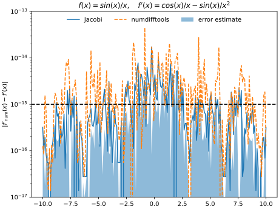

# Jacobi

Fast numerical derivatives for real analytic functions with arbitrary round-off error.

## Features

- Robustly compute the generalised Jacobi matrix for an arbitrary real analytic mapping of ℝⁿ → ℝⁱ¹ × ... × ℝⁱⁿ
- Derivative is computed to specified accuracy or until precision of function is reached
- Robust algorithm based on John D'Errico's [DERIVEST](https://de.mathworks.com/matlabcentral/fileexchange/13490-adaptive-robust-numerical-differentiation): flawlessly works with functions that have large round-off error (internal computation in float32 precision or lower)
- Up to 100x faster than [numdifftools](https://pypi.org/project/numdifftools/) at equal precision
- Computes error estimates for derivatives
- Supports arbitrary auxiliary function arguments
- Lightweight package, only depends on numpy

## Example

```py
from matplotlib import pyplot as plt
import numpy as np
from jacobi import jacobi


# function of one variable with auxiliary argument; returns a vector
def f(p, x):
    y = p + x
    return np.sin(y) / y


x = np.linspace(-10, 10, 1000)
fx = f(0, x)
fdx, fdex = jacobi(f, 0, x) # returns derivative and error estimate

plt.plot(x, fx, label="f(x) = sin(x) / x")
plt.plot(x, fdx, ls="--", label="f'(x)")
plt.legend()
plt.show()
```


## Comparison to numdifftools

#### Speed

Jacobi makes better use of vectorised computation than numdifftools.


#### Precision

The machine precision is indicated by the dashed line.


