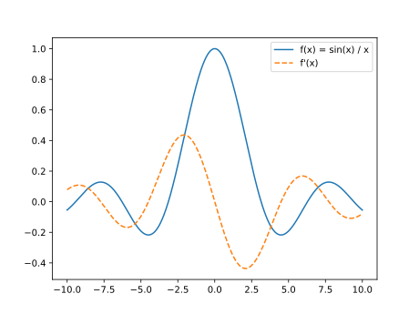
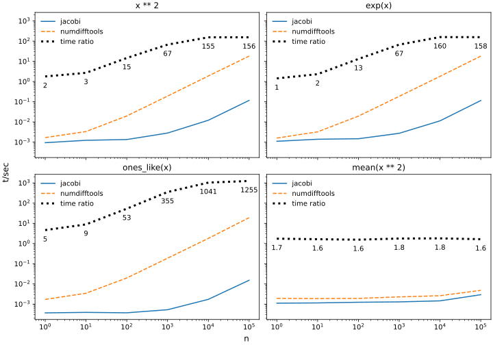
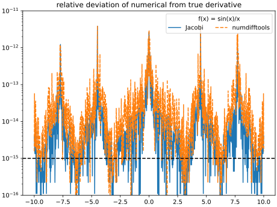

Jacobi
======

Fast numerical derivatives for real analytic functions with arbitrary round-off error.

Features
--------

- Robustly compute the generalised Jacobi matrix for an arbitrary real analytic mapping of ℝⁿ → ℝⁱ¹ × ... × ℝⁱⁿ
- Derivative is computed to specified accuracy or until precision of function is reached
- Robust algorithm based on John D'Errico's `DERIVEST <https://de.mathworks.com/matlabcentral/fileexchange/13490-adaptive-robust-numerical-differentiation>`_: flawlessly works even with functions that have large round-off error
- Up to 1200x faster than `numdifftools <https://pypi.org/project/numdifftools>`_ at equivalent precision
- Computes error estimates for derivatives
- Supports calculation of derivative only up to target precision (speed-up)
- Supports arbitrary auxiliary function arguments
- Lightweight package, only depends on numpy

Example
-------

.. include:: docs/plot/example.py
  :language: python
  :lines: 1-19

Comparison to numdifftools
--------------------------

Speed
^^^^^

Jacobi makes better use of vectorised computation than numdifftools.

Precision
^^^^^^^^^

The machine precision is indicated by the dashed line.

